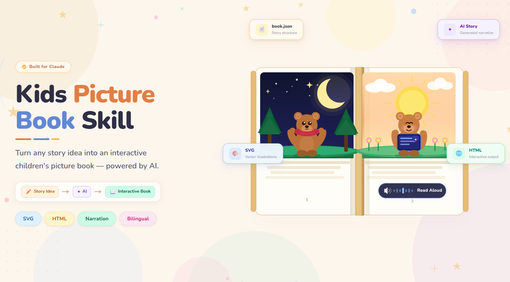

# Kids Picture Book Skill



A reusable AI-agent skill for turning a topic or story idea into an interactive children's picture book. It produces one self-contained HTML file with page-by-page text, original inline SVG illustrations, navigation, per-page narration, and auto-read mode.

[中文说明](#中文说明)

## What it creates

- One browser-openable HTML picture book
- Cover, story pages, and an ending page
- Inline SVG illustrations — no external images, fonts, scripts, or webpages
- Chinese or English interface and browser narration fallback
- Optional base64-embedded audio per page
- Previous/next controls, page dots, keyboard arrows, and auto-read mode

## Repository layout

```text
kids-picture-book/
├── SKILL.md                    # Instructions for an AI agent / custom skill
├── assets/
│   └── book_template.html      # Interactive HTML template
├── examples/
│   └── book.json               # A working sample book
├── references/
│   └── svg_guide.md            # Illustration rules and SVG examples
├── scripts/
│   └── build_book.py           # JSON → standalone HTML builder
├── LICENSE
└── README.md
```

## Quick start

Requirements: Python 3.9 or newer. The builder uses only Python's standard library.

```bash
# From the repository root
python scripts/build_book.py examples/book.json output/little-rainbow.html
```

Open `output/little-rainbow.html` in Chrome, Edge, Safari, or another modern browser.

The example has no embedded audio. Its speaker buttons use browser speech synthesis when a compatible voice is available.

## Create your own book

1. Copy `examples/book.json`.
2. Replace the title, story text, SVG illustrations, and optional `audio` values.
3. Keep one inline SVG per page, each with a `viewBox`.
4. Give every SVG ID a unique name across the entire book: `sky-cover`, `sky-01`, `sky-02`, and so on.
5. Build the file:

```bash
python scripts/build_book.py my-book.json output/my-book.html
```

Read [`SKILL.md`](SKILL.md) for the full content-generation workflow and [`references/svg_guide.md`](references/svg_guide.md) before drawing illustrations.

## Narration and offline use

The generated HTML does not download external assets. It does not load external images, fonts, scripts, audio, or websites.

- **Browser narration fallback:** Leave `audio` blank. The browser will try Web Speech API. Voice availability and offline behavior vary by browser and device.
- **Reliable offline narration:** Generate audio before building, convert it to base64, and set each page's `audio` field to a `data:audio/...;base64,...` URI.
- **Online TTS:** Tools such as `edge-tts` require network access while generating audio. Do not claim that step is offline.

## Security notes

`build_book.py` validates the book structure and rejects common active or external SVG content, including scripts, event handlers, remote links, and duplicate SVG IDs. That is a practical guardrail, not a complete security review.

Do not build a book from `book.json` or SVG markup you do not trust.

## Use as a Claude custom skill

The skill-compatible files are `SKILL.md`, `assets/`, `references/`, and `scripts/`.

To make a `.skill` package, zip the `kids-picture-book` folder itself so `SKILL.md` is at the top level of the archive. Then upload the archive through Claude's custom skill interface.

## License

This project is released under the [MIT License](LICENSE).

---

# 中文说明

这是一个可复用的 AI Agent / Claude Skill：把一个主题或故事想法变成一本可翻页、可朗读的儿童绘本。最终输出是一个独立 HTML 文件，双击即可在浏览器打开。

## 它能做什么

- 生成封面、正文页和结尾页
- 每页有短文案和原创内联 SVG 插画
- 支持中文或英文按钮与浏览器朗读
- 支持每页嵌入真实音频（可选）
- 支持上一页、下一页、圆点跳页、键盘方向键和自动朗读
- 成品不加载外部图片、字体、脚本、音频或网页资源

## 最快使用方法

需要 Python 3.9+；打包脚本不需要安装任何第三方 Python 包。

```bash
python scripts/build_book.py examples/book.json output/little-rainbow.html
```

然后打开 `output/little-rainbow.html`。

## 重要限制

- 示例没有嵌入音频。播放按钮会尝试调用浏览器自带朗读；不同设备的语音和离线能力不同。
- 想要可靠的离线语音，需要事先生成音频，并把音频以 base64 写入每页的 `audio` 字段。
- 如果用 `edge-tts` 等在线 TTS 服务，**只是在生成音频那一步需要网络**；最终 HTML 可以不依赖外部资源。
- 不要用未知来源的 JSON 或 SVG 直接构建。脚本会拦截常见危险内容，但不能代替完整安全审查。
